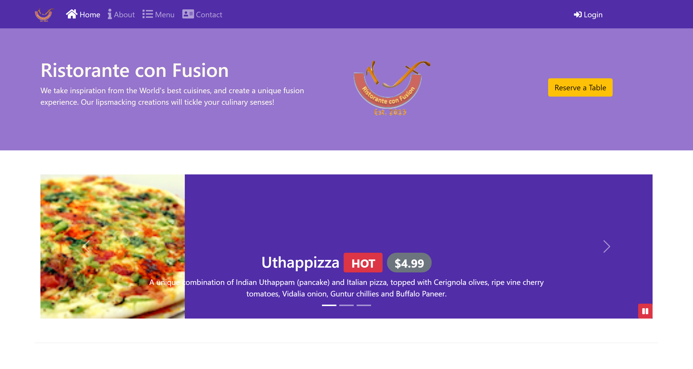

# Ristorate con Fusion Website

This website was built using mainly Bootstrap, using some preprocessors and some of JavaScript.

## Table of contents

- [Overview](#overview)
  - [The project](#the-project)
  - [Screenshot](#screenshot)
  - [Links](#links)
- [My process](#my-process)
  - [Built with](#built-with)
  - [What I learned](#what-i-learned)
  - [Useful resources](#useful-resources)
- [Author](#author)

## Overview

### The project

Users should be able to:

- See a website with the bootstrap style

### Screenshot

### Links

- Solution URL: [Solution URL here]()
- Live Site URL: [Live site URL here]()

## My process

### Built with

- Semantic HTML5 markup
- CSS custom properties
- Mobile-first workflow
- Bootstrap

### What I learned and put into practice

- Work with Bootstrap
- CSS Styles

### Useful resources

- [Bootstrap](https://getbootstrap.com/) - Documentation of Bootstrap

## Author

- Website - [Nicolas Conde Salazar](https://www.ncondes.com)
- Linkedin - [Nicolas Conde Salazar](https://www.linkedin.com/in/ncondes/)
